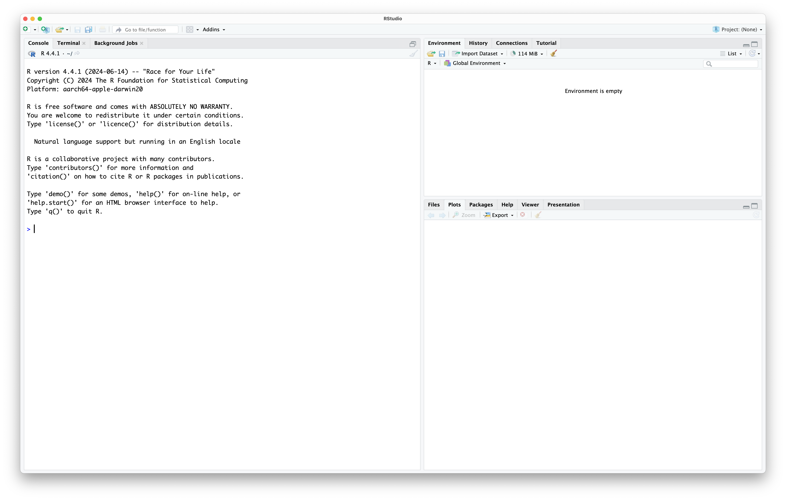
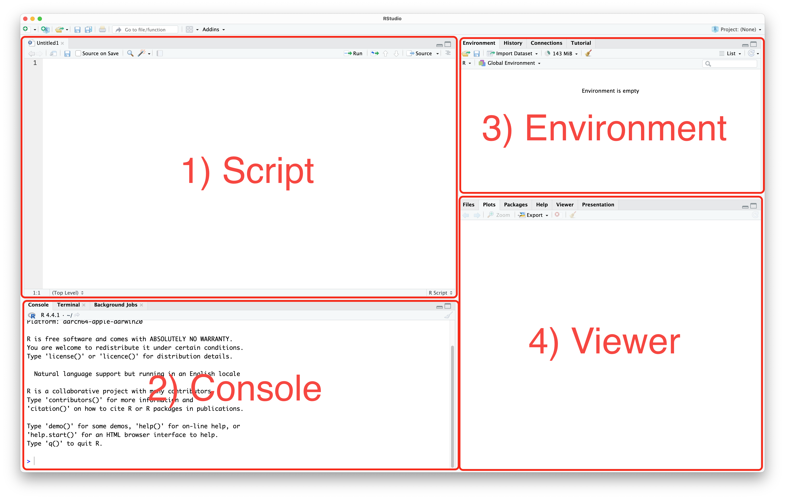
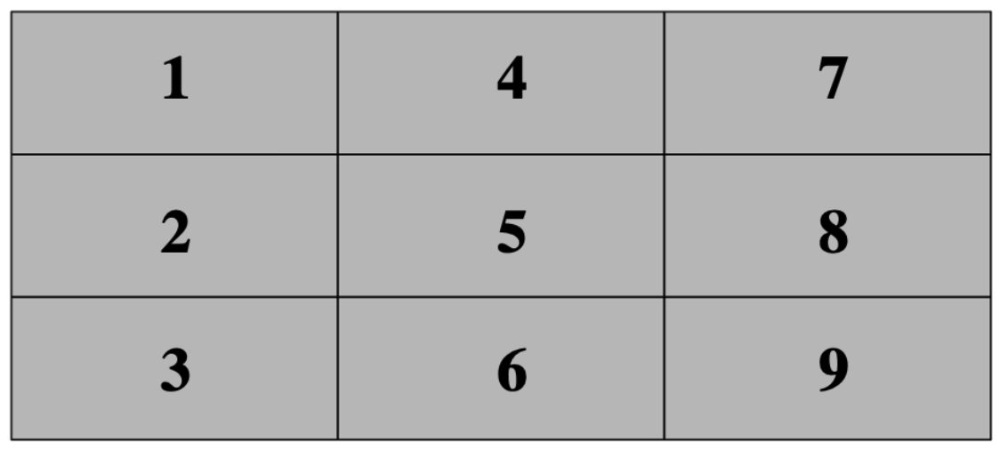

The exercises in this session are intended for you to start to become familiar with R and Rstudio. Do not worry if everything has not "clicked" by the end. You will gain more confidence the more time you spend using these tools.

# Getting familiar with RStudio

Once you have downloaded both R and RStudio, open RStudio. Your installation of R should be automatically detected, and you will be greated with an interface that looks like this:



Rstudio is designed around a four panel layout. Currently you can see three of them. To reveal the fourth, go to *File* -> *New file* -> *R script*. Now your window should look like this:



1. **Script**: a script is simply a text file, where you write and save commands. It is designed to be read like English, left to right and top to bottom. The order of commands matters! The most common way to work with R is to write your commands in a script, and then send those commands to the console. Saving your script allows you to come back to a project later, or send it to someone else.
2. **Console**: the console is where you write or send commands to be executed by the computer. Usually, you have written your commands in the script, and send each line of commands to the console using either the *Run* button, or by using `Ctrl+Enter` (Windows) or Cmd+Enter (macOS). You can also send the whole script to the console, using the *Source* button, or by using `Ctrl+Shift+S` (Windows) or `Cmd+Shift+S` (macOS).
3. **Environment**: this panel shows you objects loaded into R. We will come back to this later.
4. **Viewer**: this panel has many functions, but is commonly used to show the output of your commands (e.g. plots), or to read the R help documentation.

# Before you start coding

There are some good habits to get into early when you start programming. Most of these apply to any programming language. They help you keep your work organised, and make sure it is reproducible.

## Working directory

We recommend you create a folder where you save all the work you do as part of the Open R Sessions. Within that folder, you should create a subfolder for each session. An example might be a folder called `open_r` that within it contains folders `open_r/01_intro`, `open_r/02_datatypes`, etc. Create a folder and subfolder for this session.

We now want to set our working directory to this folder. A working directory is the directory (folder) in a file system where a user is currently working. It is the default location where commands, scripts, and programs are stored and executed and where files are read from or written to unless specified otherwise. To set the working directory using RStudio, go to *Session* -> *Set working directory* -> *Choose directory*, then navigate to the folder you just made for this session. 

You should notice that doing this, the command `setwd(your_directory)` was sent to the console. Most buttons in RStudio will simply run an R command, that you could also write.

## Creating a script

To create a new script (if you have closed the one you made before), go to *File* -> *New file* -> *R script*. Now save this script into your folder for this session, by going to *File* -> *Save*. Give the file a name that makes sense to you. R script files generally end with the extension `.R` or `.r`.

## Some good practises

It is possible to write comments in an R script that are not read by the computer. To do this, you start a line with a `#`. You can use this feature to write notes to yourself as you go, but you can also use it to give your script a title, so you remember what it does, or what it was for. For example, I might include at the start of my script:

```r
# Open R Sessions 01
# 2025-09-11
```

Add something similar to your script.

Another common practise is to include the command `rm(list=ls())` at the start of an R scripts. This command will clear the R environment of all variables. It helps to make sure that your script will always run the same no matter who runs it. Add this line to the top of your script now.

```r
# Open R Sessions 01
# 2025-09-11

rm(list=ls())
```

Another good practise is to declare your working directory at the start of a script. You can do this using the `setwd()` we encountered before.

```r
# Open R Sessions 01
# 2025-09-11

rm(list=ls())

setwd(write your directory here)
```

Remember to save your script!

You are now setup to do some coding!

# Exercises

## Importing data to R

You will often want to use R to analyse some of your data. The first step is naturally to import it into R. On the canvas page, you can download a dataset called `Simple_data.txt`. Download it and move it to the folder you set as a working folder. Most of you are used to working with data in Excel files and not text files. Don’t worry! We will talk more about file types in the coming sessions. For now, you want to import the file with `read.delim()`. First, write the command `list.files()` into your script, and run it. This lists all the files in your working directory. Does the `.txt` files appear? If so, then write and run `data <- read.delim("Simple_data.txt", head=T, sep="\t")`.

The data file has now been imported to R and stored in the object `data`. An easy way of getting an overview of the data is by looking at the top 5 rows with the command `head(data)`. To see the whole file, you can also open it by clicking on the object which has now appeared in the Global Environment. As you can see, it contains four columns with information on some of Simon's samples of lark species. Return to the script by clicking on the correct tab. To get some basic summary statistics of the datafile you can try a few other commands.

Try `str(data)`, `table(data$Species)`, `table(data$Sex)`, and `table(data$Species, data$Sex)`. 

Now, try on your own to make a table containing the number of individuals of each population and species.

Hopefully, this will give you a very fast idea of some of the content of this data. More on importing files and the `str()` command in the coming sessions! 

## R as a very powerful calculator

One of the many ways of using R is simply to use it as a calculator. You just need to write the formula you desire to calculate and R will do it immediately. Note that R will always follow the mathematical calculation priorities. These priorities can be overruled with the use of parenthesis. Some mathematical operators used in R are the following: `+`, `-`, `*`, `/`, `^`. Here are some examples:

```{r}
#| eval: true
#| code-fold: false
23+13

4*5+7

4*(5+7)

4*(5+7)^2
```

## Creating variables in R

In R, a variable is a name assigned to a value or a data object, which can be used to store data for later use. Variables in R can hold various types of data, including numbers, strings, vectors, lists, and more. We cover this in the next session. Variables are created using the assignment operator `<-`.

```{r}
#| code-fold: false
#| eval: true
# Assigning a numeric value to a variable
x <- 10

# Assigning a string value to a variable
course <- "Open R Sessions"

# Assigning a vector to a variable
numbers <- c(1, 2, 3, 4, 5)

# Assigning a list to a variable
person <- list(name = "Alice", age = 30, occupation = "Engineer")

```

Notice that once you declare a variable, it appears in the environment tab.

To print any object to the console in R, you can simply write its name:

```{r}
#| code-fold: false
#| eval: true
person
```

Let's focus on the variable we just made called `x`. We can now use `x` in other commands. For example, we could find the square root of `x`:

```{r}
#| code-fold: false
#| eval: true
sqrt(x)
```

Notice that if we change what `x` is, we get a different answer:

```{r}
#| code-fold: false
#| eval: true

x <- 42

sqrt(x)
```

The order your commands come in matters.

---

# Games

Previous members of the Open R Team have coded some games in R:

This section is purely for entertainment and for you to feel more comfortable about using an R script, the console and so on. You will find detailed instructions below on how to proceed with these game exercises. For those of you very curious about it and up for the challenge, you can go through the code to see how it works to see how much of it you understand. We encourage you to come back to the scripts of these games after being done with the Open R Sessions to see if you manage to understand more of it!

As mentioned during the seminar, programming is about asking the computer to
execute some tasks in a specific way. For today's session we have programmed 3
games that you can play with for as long as you want: 

1. Tic-tac-toe
2. rock, paper scissors
3. guess the number. 

Games 1 and 3 you can play along with a classmate/friend. Game 2 is played against the computer.

To play these games we first need to "load" them into R. Run the following command fetch the code from GitHub, and create three functions used to play the games.

```{r}
#| code-fold: false
#| eval: false
source("https://gist.githubusercontent.com/irmoodie/ba17e016cd317cdeb9b169932c100c93/raw/a171462fdc5484574bcafd10b8fe7f4147af81c7/R_Intro_Games.R")
```

You can see the full code here if you are interested: [`R_Intro_Games.R](https://gist.github.com/irmoodie/ba17e016cd317cdeb9b169932c100c93).

## Tic-tac-toe

For this game to make sense we need to explain to you briefly some details about it.
As you know this game is played on a board that has 3x3 spaces (i.e., a 3x3 matrix)
where you can choose each turn where to put either an X or an O. The first to have 3
in a row is the winner.

For the sake of simplicity in programming, we replaced X and O with colours (black
and white) that each player can assign when their turn is due. The matrix is initially
empty (coloured in grey, meaning that no player has used that cell yet) and each cell
in the matrix is numbered in the following way:



The console will ask each player which cell they want to play in. You simply have to
input the cell number you want to use and then press “Enter”.

To play this game just type `tictactoe()` in the console. The console will then ask for the
player names, to which you just have to write them in the console and click on enter
(see picture below). Now you will be able to start playing!

## Rock paper scissors

This game is even simpler. To start it just type `rockpaper()` in the console. In this case,
the console will just ask you your name and then ask you which hand (rock, paper or
scissors you want to choose) the computer will simultaneously choose one along with
you. If you draw then the computer will ask you to choose your next hand until there
is a winner. May the best between you and our script win!

## Guess the number

This game is also straightforward. Type `guessnumber()` in the console to play it. This time you compete against a friend to see who
first guesses the random number between 1 and 10 that the computer chose. The
console will start by asking your names and will then proceed to ask each one of you
to guess a number. The first one to guess it wins.

### Challenge

If you feel up to it, below is the code for the function `guessnumber()`. Can you see how you would modify the code to allow for numbers between 1 and 20, instead of 1 and 10? How about so that the numbers must be between 12 and 16?

If you want, copy the code into an R script and try out your edits!

```{r}
#| code-fold: true
#| eval: false
guessnumber <- function() {
  cat("Welcome to our Guess the Number game")
  name1 <- readline(prompt = "Write your name here: ")
  name2 <- readline(prompt = "Write your friend's name here: ")
  maxnum <- 10
  numchosen <- sample.int(maxnum, 1)
  winner <- F
  repeat {
    numguess <- as.numeric(readline(prompt = "Guess a number between 1 and 10: "))
    numguess2 <- as.numeric(readline(prompt = "Make your friend guess a number between 1 and 10: "))
    if (numguess == numchosen) {
      cat("The correct number was", numchosen, "\n")
      cat("Congratulations,", name1, "you win!\n")
      break
    } else {
      cat("I'm sorry,", name1, "your answer is incorrect.\n")
    }
    if (numguess2 == numchosen) {
      cat("The correct number was", numchosen, "\n")
      cat("Congratulations,", name2, "you win!\n")
      break
    } else {
      cat("I'm sorry,", name2, "your answer is incorrect.\n")
    }
  }
  
}
```